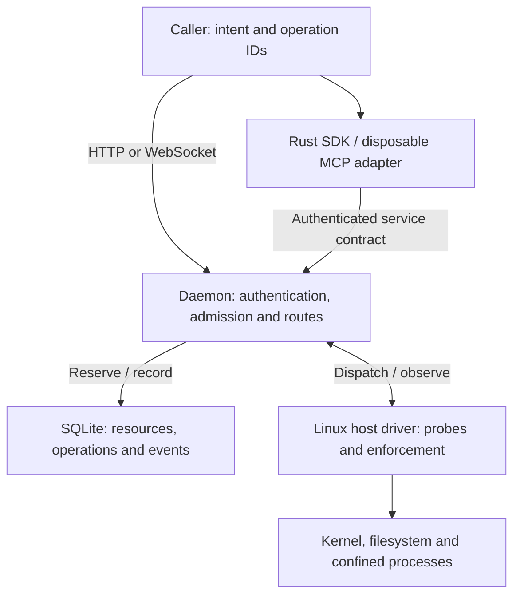
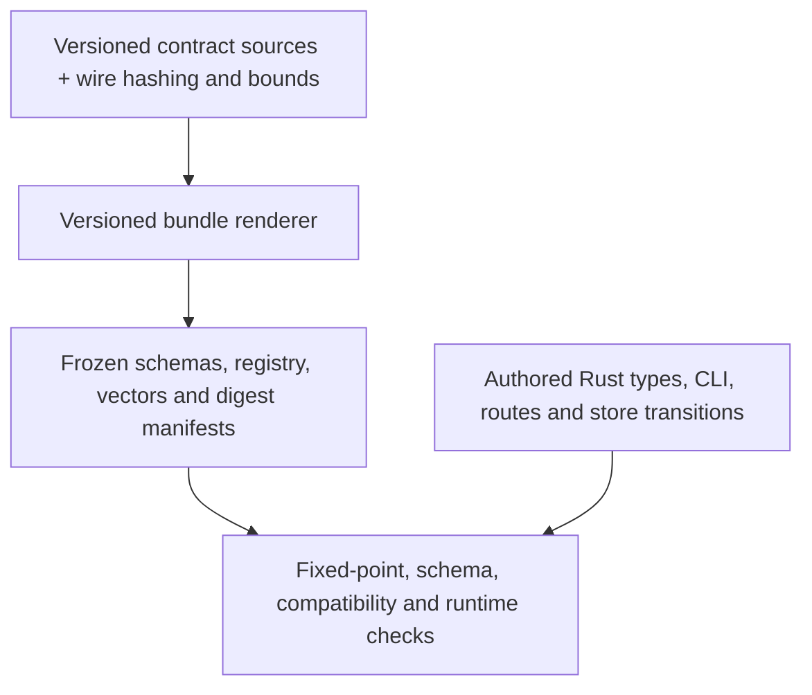

# What defines the system?

Substrate has an explicit wire contract and implemented resource lifecycles. It does not currently
have one ESS system specification from which all its subsystems, commands, events and CLI are
derived. Its definitions live in Rust types, versioned contract sources, route handlers and durable
store transitions. Conformance checks connect those definitions; they do not replace them.

This page describes the Linux host implementation in release `0.7.3`, which advertises the
`substrate-wire/0.16.0` development contract. See [status](../status.md) for availability and
[the route reference](../reference/contract.md) for addresses.

## Subsystems and ownership

The SDK calls the daemon. The disposable MCP adapter translates tools and resources through that
SDK. The daemon coordinates admission and lifecycle work; the host driver proves and applies
confinement; SQLite retains the evidence needed after a disconnect or restart.

| Source owner | Definition it owns |
|---|---|
| `substrate-wire` | Typed requests, resources, observations, events, refusal vocabulary and canonical request hashing |
| `substrate-daemon` | Transport authentication, route dispatch, admission and lifecycle coordination |
| `substrate-store` | Durable reservations, subject-scoped resources, stored answers, event sequence and recovery views |
| `substrate-host` | Linux probes, workspace I/O, process confinement, quotas and measured outcomes |
| `b10x-substrate-sdk` / `substrate-mcp` | Client handles and recovery; bounded MCP tools, resources and session translation |
| `xtask` / `substrate-contract-check` | Bundle rendering, schema and compatibility checks, and contract conformance checks |

These are source responsibilities, not separately deployed services. The implementation is in the
public [workspace crates](https://github.com/beyond10x/substrate/tree/0.7.3/crates).

## Model coverage

In this handbook, a caller creates workspace **W1**, writes `input.txt`, and starts exec **X1**
with operation **O1**. These short labels are illustrative: resource IDs are opaque, and real
operation IDs must satisfy the [operation ID rules](./operations.md#retry-identity).

| Domain | Explicitly represented today | Example or boundary |
|---|---|---|
| Machine and capabilities | Driver generation, probed facts, limits and capability snapshot | X1 binds to the inspected snapshot; missing facts cannot authorize a capability |
| Workspace | Identity, source, state, labels, guarded bytes, optional storage bound and lease | W1 may start empty or from an authorized, configured Git source |
| Exec | Start input, argv, environment, requested/applied confinement, limits, state, output and usage | X1 hashes W1's input under the requested bounds |
| Session | Raw-pipe or PTY mode, resource state, lease, bounded attachment and hosted attachment authority | A protocol process uses the same execution boundary |
| Command and operation | Typed mutation input, caller ID, request hash, reservation state and stored outcome | O1 identifies the start request; it is distinct from X1 |
| Events | Closed transitions, resource identity, generation, sequence, actor, cause and observation | An exec observation can be correlated with its causing operation |
| Recovery | Operation lookup, retained event cursors and reconciliation snapshots | A caller recovers after losing a response or falling behind event retention |
| Authority and enforcement | Authenticated subject, delegated admission, grants, source authority, capsules, secret slots and egress apertures | These constrain admission or execution; product identity and policy remain outside |

There is one important limit to event coverage: sessions have typed resources, requests and
lifecycles, but the public event vocabulary does **not** have a separate `session.*` branch.
Session transitions publish an operation-ledger projection such as `operation.terminal` or
`operation.unknown`. Inspect the session resource for its state. This behavior is explicit in the
[store's event projection](https://github.com/beyond10x/substrate/blob/0.7.3/crates/substrate-store/src/events.rs)
and the [wire event validator](https://github.com/beyond10x/substrate/blob/0.7.3/crates/substrate-wire/src/lib.rs).

Workloads, images, volumes and endpoints are future resource families, not implemented route
families in this host slice. Docker and Kubernetes drivers are also absent. A general architecture
goal therefore does not imply complete served domain coverage.

## What is derived, and what is authored?

Bundle source is authored under
[`xtask/bundle-source`](https://github.com/beyond10x/substrate/tree/0.7.3/xtask/bundle-source).
The renderer produces deterministic bundle bytes and digest manifests, using the wire crate's
controlled hashing and bounds bindings. The JSON schemas are **not generated from Rust types**.
Released trees under
[`contracts/substrate-wire`](https://github.com/beyond10x/substrate/tree/0.7.3/contracts/substrate-wire)
remain immutable and must reproduce byte for byte with their own renderer.

The daemon's command-line parser is authored with `clap` in
[`main.rs`](https://github.com/beyond10x/substrate/blob/0.7.3/crates/substrate-daemon/src/main.rs).
HTTP handlers and store transitions are authored Rust too. Neither the CLI nor its release changes
are generated from an ESS or Entity Runtime model. Contract checks prove specific relationships
between declarations and behavior; they do not establish whole-system derivation.

Follow [operations and observations](./operations.md) to see how W1, O1 and X1 relate during a
request, then [run the command](../guides/run-a-command.md).
