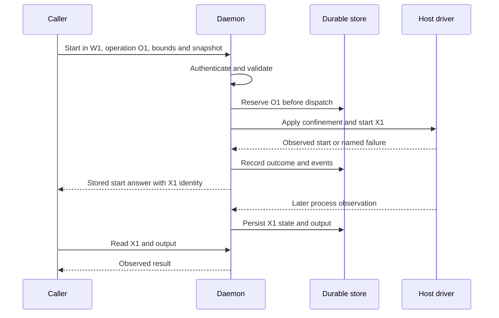

# Follow a command from intent to observation

Suppose workspace **W1** contains `input.txt`. The caller wants exec **X1** to run
`/usr/bin/sha256sum /workspace/input.txt` and supplies operation **O1** for that start request.
W1, X1 and O1 are explanatory labels, not literal valid IDs to send to the API.

## Three identities, two lifetimes

| Identity | Answers | Lifetime |
|---|---|---|
| Workspace W1 | Where are the guarded input and output files? | Until destruction or lease expiry |
| Operation O1 | Was this start request accepted, and what answer was recorded? | Retained in the bounded operation ledger |
| Exec X1 | What is the process doing, and what did it produce? | Running, then terminal or unknown; later retired |

An asynchronous start operation can finish successfully while its exec is still running.
`operation.terminal` is not proof that the child process exited. Read X1 for process state and exit
status; read O1 to reconcile acceptance and the recorded start answer.

Reservation closes the gap between acceptance and an external effect. A malformed request or a
request rejected before durable admission may have no ledger row; receiving any HTTP response is
not, by itself, proof that an operation was reserved.

## Retry identity

Mint one operation ID for each intended mutation: 16–128 ASCII letters, digits, underscores or
hyphens. Keep it with the exact request. Within the authenticated subject scope, the canonical
identity includes the method, address, query and input. Reusing the ID for different request
content is a conflict.

After a lost response, query `GET /v1/ops/{operation_id}` or resend the same request with the same
ID. A stored answer is replayed; a pending operation remains something to reconcile. Replaying
still requires current authentication and valid delegated authority. A ledger record does not
restore expired permission.

Do not mint another ID merely because O1's response was lost or its outcome is `unknown`: a second
ID can authorize a second effect. Conversely, a **recorded refusal or terminal error is replayed**,
not re-executed. After fixing its cause and deciding to make a new attempt, use a new operation ID.

## Read the outcome before deciding what to do

| Outcome | Meaning | Next decision |
|---|---|---|
| `refused` | A guard, authority check, validation or precondition said no | Correct the cause; a recorded refusal needs a new ID for a new attempt |
| `conflict` | Request identity or resource state disagrees | Re-read state and check whether the ID was reused incorrectly |
| `unserved` | The requested capability cannot be served here | Stop or choose a deployment that advertises it |
| `exhausted` | A bound or capacity prevents admission | Free capacity; use a new ID for a deliberate attempt after a recorded refusal |
| `failed` | The admitted action failed | Inspect the recorded outcome and resource state before attempting another effect |
| `unknown` | The terminal effect cannot be proved | Reconcile the existing operation and resource; do not assume success or absence |

A non-zero child exit is an observed exec result, not automatically a failed start operation.
Truncated output remains explicit. Missing usage facts remain absent rather than becoming zero.
After a restart, an unprovable in-flight effect can become `unknown`.

## Events, metrics and recovery have different jobs

Events carry a generation and sequence, a resource and transition, a cause, and an observation.
They let a consumer follow durable changes such as `workspace.created`, `exec.exited` and
`operation.terminal`. Replay is bounded by retention; it is not an unlimited audit archive.
Sessions currently use operation-ledger events rather than a separate `session.*` vocabulary,
as described in [model coverage](./model.md#model-coverage).

If the consumer falls behind retained history, create a reconciliation snapshot, read its bounded
pages, and resume from its cursor. This snapshot is a barriered view of resource state, **not a
backup or restorable filesystem image**. Live metrics are separate latest-wins observations and
do not offer durable event replay.

## Leases and cleanup

Workspaces, execs and sessions may carry renewable leases. Expiry causes lifecycle work and an
observable result; it does not prove that cleanup succeeded. Inspect unknown or cleanup-failed
outcomes instead of assuming the resource disappeared. After X1 is terminal, retire it and destroy
W1 when its files are no longer needed.

The [command walkthrough](../guides/run-a-command.md) implements this journey with real IDs,
bounded polling and explicit cleanup. The [contract surface](../reference/contract.md) lists the
operation, event and reconciliation routes.
